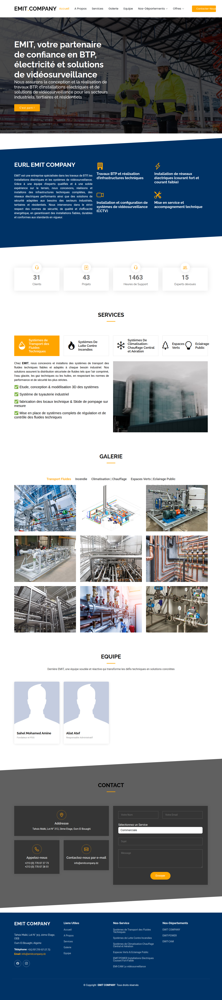

# الموقع الرسمي لشركة EMIT

---
## 🌐 الموقع مباشر
[www.emitcompany.dz](https://www.emitcompany.dz)

---
## 📌 فهرس المحتويات
- [عن المشروع](#عن-المشروع)
- [التقنيات المستخدمة](#التقنيات-المستخدمة)
- [الميزات الرئيسية](#الميزات-الرئيسية)
- [هيكلية المشروع](#هيكلية-المشروع)
- [لقطات الشاشة](#لقطات-الشاشة)
- [تنويه حول الكود المصدر](#تنويه-حول-الكود-المصدر)
- [المطور](#المطور)

---
## 📌 عن المشروع
يمثل هذا المشروع الموقع الرسمي لشركة **EMIT Company**، المتخصصة في:  
- التركيبات الكهربائية  
- تجميع اللوحات الكهربائية  
- أعمال البناء (BTP)  
- أنظمة المراقبة والفيديو (CCTV)  
- الصيانة الوقائية والتصحيحية  

الهدف من الموقع هو عرض خدمات الشركة وخبرتها ومعلومات الاتصال بطريقة احترافية ومتوافقة مع جميع الأجهزة.

---
## 🛠 التقنيات المستخدمة

### الواجهة الأمامية (Frontend)
- HTML5  
- CSS3  
- Bootstrap 5  
- JavaScript  

### الواجهة الخلفية (Backend)
- PHP (معالجة نموذج الاتصال والتحقق من البيانات على الخادم)

### تحسين محركات البحث والأداء
- sitemap.xml  
- robots.txt  
- تصميم متجاوب Mobile-first  
- تحسين الأصول

### الاستضافة والنشر
- استضافة مشتركة (cPanel)  
- النشر عبر FTP

---
## ⚙ الميزات الرئيسية
- تصميم متجاوب بالكامل  
- نموذج اتصال مع تحقق من البيانات على الخادم  
- قائمة تنقل منظمة  
- هيكلية صديقة لمحركات البحث  
- تحميل سريع وأداء محسّن  
- واجهة مستخدم احترافية

---
## 🏗 هيكلية المشروع
**Frontend:**  
- التخطيط  
- التوافق مع الأجهزة  
- هيكلية UI/UX  

**Backend:**  
- معالجة بيانات النماذج  
- إدارة البريد الإلكتروني  
- التحقق الأساسي من الخادم

---
## 📸 لقطات الشاشة

---
## 🔒 تنويه حول الكود المصدر
الكود الكامل خاص لأسباب تجارية.  
هذا المستودع مخصص فقط للوثائق والعرض.

---
## 👨‍💻 المطور الرئيسي
**ALIAT Atef** – مسؤول تطوير البرمجيات وحلول الرؤية الحاسوبية في EMIT Company

_آخر تحديث: فبراير 2026_
